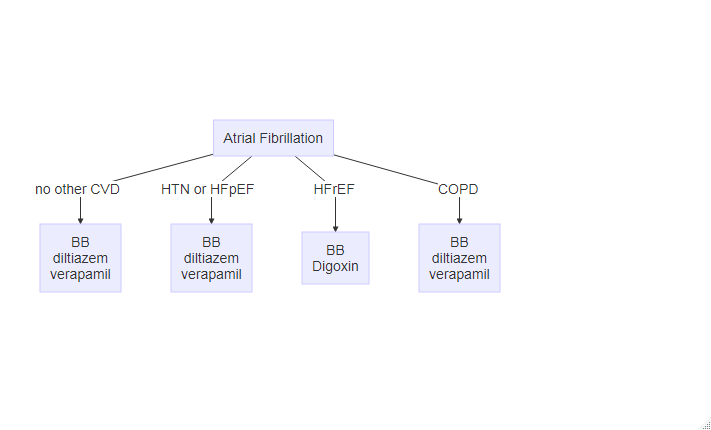

# Cardiology

## Heart Failure

### Note

```
Acute (on chronic?) systolic (or diastolic) dysfunction - 
- Presence of ICD/ppm?
- Last EF?
- Work-up:
       - EKG: 
       - Imaging: CXR, Echo
       - Labs: BNP, Trop
- Preload: IV diuresis - DOSE trial (2.5x home dose), TDD of home diuretic x2 
and give as BID/TID for 48-72 hrx
- Afterload: 
- Neurohormonal: 
- R/R:
- Ischemia: statin, ASA
- Diet: salt-restricted diet. If class D HF, consider FWR
- Labs: monitor lytes; maintain K > 4, Mg > 2
    - BID labs?
- Indication for ICD or CRT?
- If HFrEF and *iron-deficiency* (w/ or w/o anemia) defined as ferritin < 100 or 
ferritin 100-299 + transferrin sat < 20% -> IV iron for functional and Sx 
improvement. Studies of the effect on mortality and hospitalization are ongoing, 
as are studies in pts w/ HFpEF.
- If HFpEF - consider spironolactone if elevated BNP, SGLT2i if T2DM
- Encourage lifestyle modifications and optimize co-morbidities
- Daily standing weights
- Strict I/O
```

### Work-up

- Work-up for _new-onset_ should include:
    - TSH
    - HIV
    - CAD evaluation
    - Substance abuse screening: EtOH, cocaine, methamphetamines
    - If HFpEF + low-voltage EKG, consider amyloidosis
- **BNP** > 100 pg/mL is predictive of HF ( > 200 if AFib)
    - Obesity artificially lowers BNP
    - Elevators of BNP include female, AFib, ACS, LVH, old age, CKD, etc.
- **NT-proBNP** < 300 pg/mL excludes HF
    - Age cutoffs: < 450 pg/mL for < 50 yo, < 900 pg/mL for 50-75 yo, < 1800 pg/mL for > 75 yo
- **EKG**
- **CXR**
- **Echo**
    - RVSP can estimate PA pressure (PASP)
        - consider possibility of Pulm HTN in those w/ RVSP > 40 mmHg + dyspnea (ACC/AHA)

### Medications

- **Beta-blockers**: metoprolol XL, carvedilol, bisoprolol
- **ACEi/ARB**
- **ARNI** - sacubitril/valsartan (Entresto)
    - PARADIGM-HF trial: ARNI 20% RR reduction vs ACEi
    - stop ACEi 24-36 hrs prior to initiation
    - lower/stop other diuretics upon initiation (b/c sacubitril's diuretic effect)
    - start at lowest dose and titrate up every 2-4 wks
    - Consider initiation during hospitalization for ADHF [PIONEER-HF trial]
- **Diuretics** - see NEJM review [article](https://www.nejm.org/doi/full/10.1056/NEJMra1703100)
    - **Loops**, such as Lasix, Bumex, Torsemide
        - Conversions: 40 mg PO Lasix = 20 mg PO torsemide = 1 mg Bumex
        - Lasix dosing:
            - BUN x 2
            - House of God - BUN + age
            - Joel Topf - Cr x 20
        - Dosing during *acute episode* - $\text{home dose} \times 2$ in IV form administered BID/TID for 48-72hrs (Clyde Yancy)
            - DOSE trial - no diff b/w continuous diuresis vs intermittent IV boluses
        - NEJM tidbits:
            - PO Lasix bioavailability is highly variable (mean, approximately 50%; range, 10 to 90). By contrast, bumex and torsemide have higher and more consistent oral bioavailability.
            - PO and IV doses of bumex and torsemide are equivalent b/c they do not have absorption-limited kinetics
            - Torsemide has a longer half-life in pts w/ HF (6 hrs) than Lasix (2.7 hrs) or Bumex (1.3 hrs). Thus, in theory torsemide should be more effective, but the data doesn't really pan out.
            - Torsemide vs. Lasix: Torsemide reduces hospital readmissions for HF (DiNicolantonio, 2012)
            - Remember that during acute decompensated HF, Na retention is more avid
        - Bob Centor gives Torsemide (prefers once daily) to new HF pts and existing HF pts who req'd metolazone during hospitalization. He'll then Rx metolazone PRN (based on daily weights). [Source](https://twitter.com/medrants/status/1167765807776092160)
    - **Aldosterone antagonists**
        - CrCl > 30 + K < 5
        - useful in HFpEF pts w/ elevated BNP
        - start at 12.5 mg daily w/ repeat K, Cr in 1 week
    - **Metolazone** can take > 24 hrs for the effect to be seen (Dr. Ooi)
- **SGLT2i** (e.g. dapagliflozin)
    - DAPA-HF trial
- **IV iron** [FAIR-HF trial]
    - if iron-deficiency +/- anemia
        - ferritin < 100 *or* ferritin 100-299 + Tsat < 20% to improve functional status and QoL
    - oral iron replacement is not effective [IRONOUT-HF trial]

### Other recommendations

- **Lifestyle modifications**:
    - Less than 2L fluid or 2g salt per day
    - Cardiac rehab
- Sleep apnea?

### "Diuretic resistance"

- Ensure adherence to fluid restriction + low-salt diet
- Ensure pt is not taking NSAIDs
- Maximize loop diuretic dose (Bumex 12.5 mg TID)
- Maximize thiazide diuretic (Metolazone 10 mg TID)
- Maximize other segment blockade (spiro 100 mg TID, acetazolamide 1000mg BID)

## Atrial Fibrillation

> If HD unstable or intractable ischemia → immediate DC cardioversion

### Classifications

- Paroxysmal - terminates spontaneously or with intervention in < 7 days; recurrence may occur
- Persistent - continuous AF lasting > 7 days; requires termination by cardioversion/ablation
- Permanent - AF > 7 days; sinus rhythm not possible, refractory to cardioversion

### Note

```
Atrial Fibrillation, (*** paroxysmal/persistent/permanent)
- Echo: ***
- CHADS2-VASc score: ***
- HAS-BLED score: ***
- R/R control: ***
    - Goal resting HR < 110 bpm (if Asx and preserved LVEF) [RACE II trial]
    - Goal resting HR < 80 bpm for Sx AF mgmt despite "lenient" rate control [RACE II trial]
- Anticoagulation: ***
    - Indicated if no significant bleeding risk and CHADS2-VASC >= 2 (men), >= 3 (women)
    - If CKD 5/ESRD -> warfarin and apixaban
- Consider checking TSH/fT4, Lytes (inc Ca, Mg)
- Treatment of other co-moribidities
    - OSA, HTN, Obesity, EtOH use disorder
- Encourage weight loss (if obese) and abstinence from alcohol (Voskoboinik et al., NEJM 2020)
```

### Rate Control Drugs



- Metoprolol tartrate: up to 200 mg BID
- Metoprolol succinate: up to 400 mg daily
- Carvedilol 3.125-25 mg BID
- Bisoprolol 2.5-10 mg daily
- Diltiazem (extended-release) 120-360 mg daily

> European Society of Cardiology and NICE guidelines recommend combination therapy if a single agent fails to control HR

### RVR management

- IV metoprolol 2.5-5 mg over 2 minutes every 5 mins (up to 3 doses)
- Dilt gtt (if EF preserved)
- Amiodarone 300 mg over 1 hr, then maintenance over 24 hrs

### Risk factors

- **Modifiable risk factors**
    - OSA
    - HTN
    - EtOH use disorder

### Cardioversion Rules

- TEE + therapeutic anticoagulation → cardioversion → at least 4 weeks of therapeutic anticoagulation (indefinitely if increased stroke risk)
- therapeutic anticoagulation x3 wks → cardioversion → at least 4 wks of therapeutic anticoagulation

## ACS/MI

## Syncope