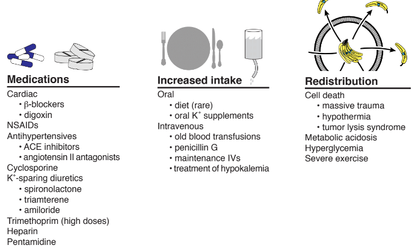

# Renal

## AKI

### Note

```
Acute kidney injury, oliguric (< 0.5 cc/kg/hr or < 400 cc/day)/non-oliguric - Cr
*** (baseline Cr: ***)
- Definition: increase in Cr by 0.3 mg/dL w/in 48 hrs or increase to 1.5 times
baseline w/in 7d or urine volume < 0.5 cc/kg/hr for 6+ hrs
- I/O review: *** (recent procedure/surgery?)
- Medication review:  NSAIDs, ACEi/ARB, acyclovir, sulfa, *navir, MTX, ethylene
glycol, aminoglycosides
- Pre-renal: sepsis, ischemia/hypotension, contrast exposure, HF, HRS, hyperCa,
abdominal compartment syndrome
- Intra-renal: rhabdo, renal a. stenosis, hemolysis/MAHA,
nephrotic/nephritic/vasculitis, rheum, myeloma, AIN, crystal (UA, etc), TLS, ATN
- Post-renal: BPH, cancer, stricture, clot, retroperitoneal fibrosis, papillary
necrosis
- Work-up: UA w/ micro, Urine lytes (Na, urea, Cr), Urine Protein (for UPC), PVR
       - Pre-renal: FeNa < 1%, Urine Na < 20-40
       - ATN: FeNa > 2%, Urine Na > 40
- Strict I/O
- Avoid nephrotoxins
- Renal dosing of medications
       - LMWH
       - analgesics: morphine, gaba/pregaba
       - Antivirals: *cyclovir
       - Antifungals: fluconazole
       - Antibacterial: almost all (exceptions: azithro, CTX, doxy, linezolid,
moxi, naf, rifampin)
       - DM: metformin, sulfonylureas
       - Other: allopurinol, lamotrigine, baclofen, colchicine
```

## Nephrotic Range Proteinuria

### Work-up

```
Workup of Nephrotic Range Proteinuria:
- Urine protein : creatinine ratio
- A1C
- TSH
- HIV, RPR
- HCV, HBV serologies
- Lipid profile
- SPEP/SFLC
 
Other tests routinely sent but should really be history driven: ANA, C3, C4,
anti-dsDNA, cryoglobulins, ASO
Renal ultrasound: important in the outpatient setting if unexplained reason for
proteinuria/CKD; helps to identify physical abnormalities (such as solitary
kidney, multiple renal cysts, small kidneys) which would make renal biopsy
contraindicated
Referral to renal for biopsy!! Usually warranted in adults if proteinuria
persistent and etiology unclear!
```

## Hyperkalemia

### Note

```
Hyperkalemia
- Check BS (hyperglycemia/DKA/HHS), CK, LDH
- Re-check K, CBC (thrombocytosis, hemolysis, WBC > 50k)
- EKG
- PVR
- Medication review: ACEi/ARB, NSAIDs, -azole, heparin/LMWH, bactrim, tacrolimus, spiro
- Consider telemetry
- Consider other causes:
       - Increased production: TLS (KcUP), rhabdo, high K diet
       - Decreased excretion: AKI/CKD, hypOaldosteronism, volume depletion, type 4 RTA
       - Cellular shift: insulin def, beta-blockers, cell death, acidemia
- Medications:
       - Calcium gluconate - 3g IV over 10 mins (lasts 30-60 mins)
       - Regular insulin 10U IV + D50 (25g glucose) if BS < 250
       - Kayexylate
- Avoid NS for fluids; LR preferable if no metabolic acidosis
- Low K diet (exclude from fluids, TPN, etc.)
```

### Steps


**Causes to review**:



[Source](http://pbfluids.com/2017/09/the-fluid-electrolyte-and-acid-base-companion/)

### EKG changes

- Peaked T-waves
- Increased PR interval and widening of QRS complex
- Flattening/loss of P wave (loss of atrial contraction)

> Severe hyperkalemia (e.g. K > 7) can occur without obvious EKG changes [Source](https://emcrit.org/ibcc/hyperkalemia/)


# Hyponatremia

- "Urea for the Treatment of Hyponatremia" (CJASN 2018) - [article](https://cjasn.asnjournals.org/content/13/11/1627)